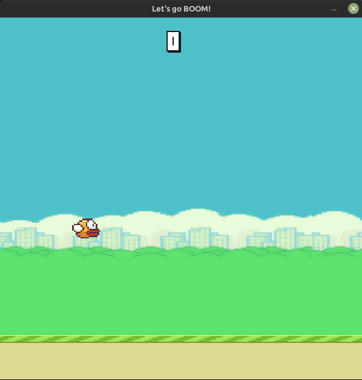
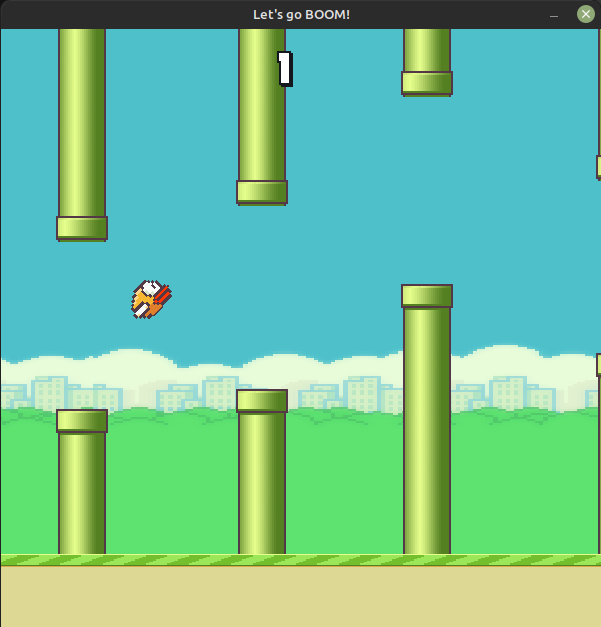
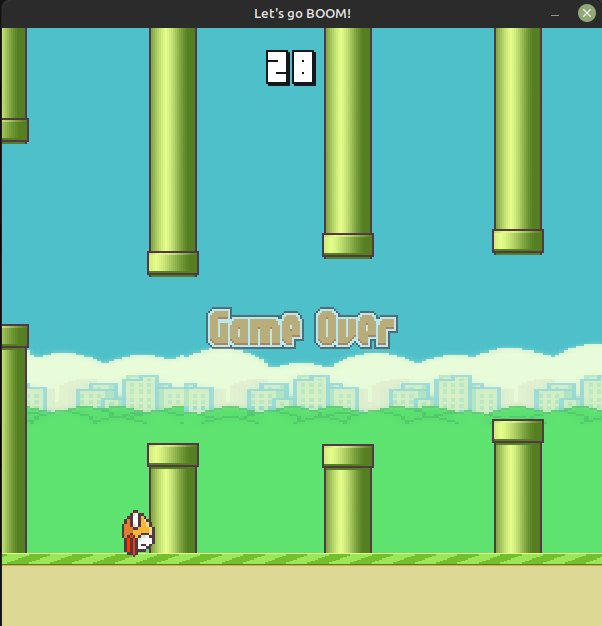

# This is my most successful project in 2022
#### I got started by learning pygame and doing on my own

#### Assets used :-
Samelcust - https://github.com/samuelcust/flappy-bird-assets - graphical assets & sound effects
Komiku - https://www.chosic.com/download-audio/25106/ - background music :)

#### Some gameplay screenies
</img>
</img>
</img>
</img>
</img>
